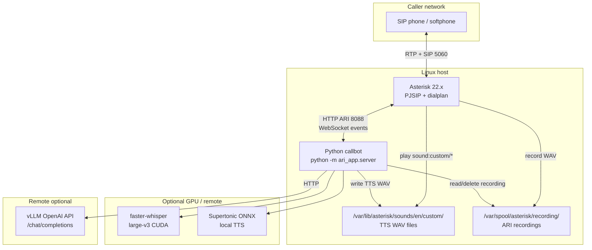
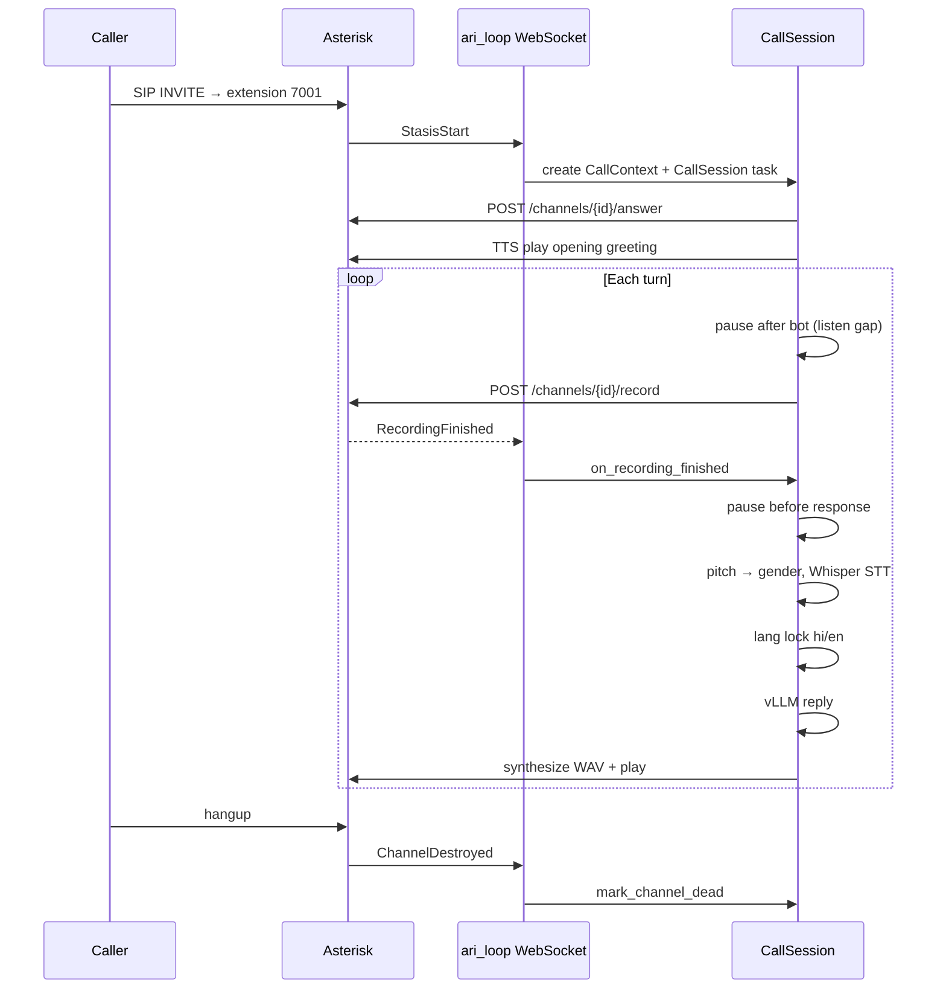
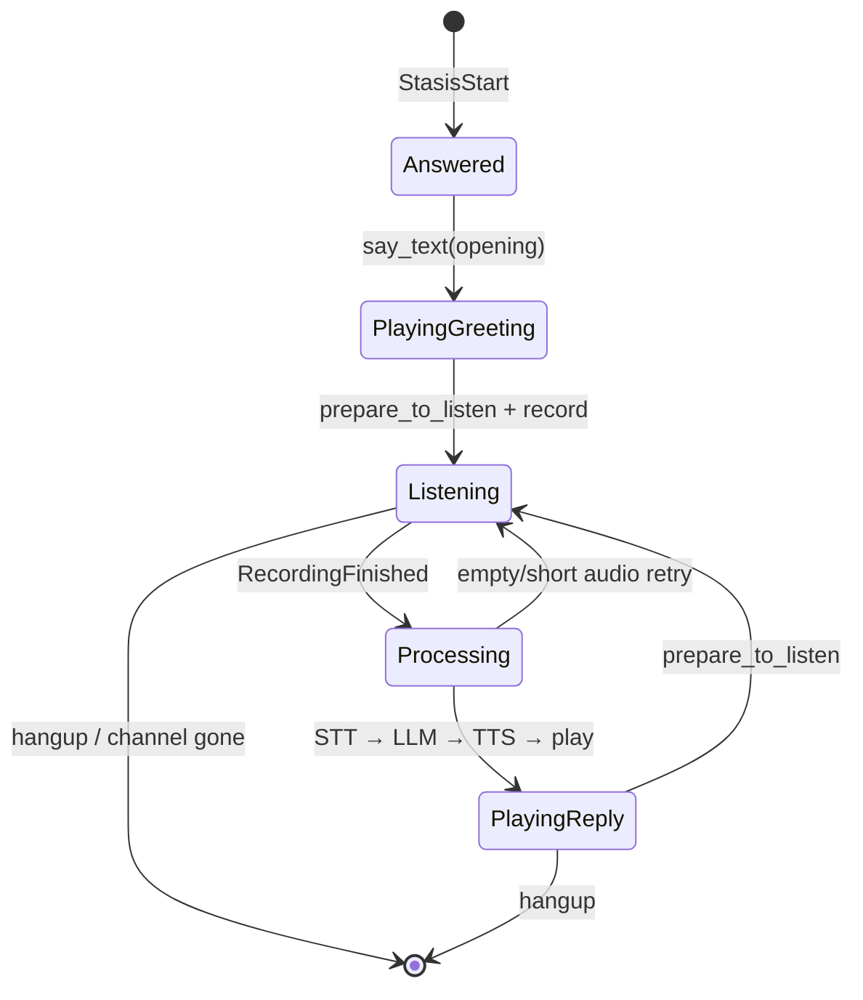
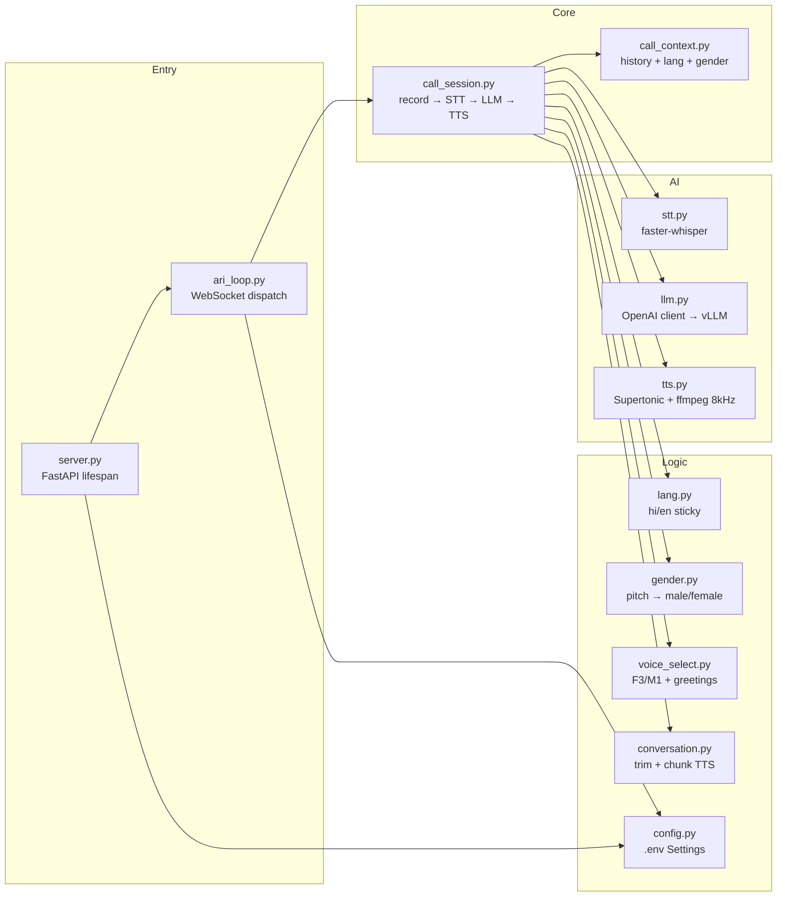

# Asterisk Callbot — Architecture

Phone call assistant: SIP caller dials an extension → Asterisk Stasis → Python ARI app records speech, transcribes, asks an LLM, synthesizes speech, plays audio back. One process handles many concurrent calls; each call has its own in-memory session.

## System context



## Runtime processes

| Process | Entry | Role |
|---------|--------|------|
| **Callbot** | `python -m ari_app.server` | FastAPI `/health` + background `run_ari_forever()` |
| **Asterisk** | `asterisk` systemd | Media, SIP, Stasis app `callbot`, ARI HTTP |

Startup (lifespan): warmup Supertonic (F3/M1) + Whisper model, optional vLLM reachability check, then ARI WebSocket loop.

## ARI event flow



## Per-call state machine



## Python package layout (`ari_app/`)



### Module responsibilities

| Module | Responsibility |
|--------|----------------|
| `server.py` | Uvicorn app, model warmup, `/health` with active calls |
| `ari_loop.py` | ARI WebSocket; routes events to `CallSession`; `ActiveCallRegistry` |
| `call_session.py` | ARI HTTP: answer, record, play, hangup; main conversation loop |
| `call_context.py` | Per-call `session_id`, message history, `preferred_lang`, `caller_gender` |
| `config.py` | Frozen `Settings` from `.env` |
| `stt.py` | Download recording → ffmpeg 16 kHz → Whisper transcribe + language |
| `llm.py` | System prompts (male/female, hi/en) → vLLM chat completion |
| `tts.py` | Supertonic synthesize → ffmpeg to 8 kHz mono for Asterisk |
| `lang.py` | Hindi/English detection, session language hysteresis, Whisper hint |
| `gender.py` | Pitch from caller WAV → male/female for voice + persona |
| `voice_select.py` | Map gender → F3/M1; Hindi/English opening lines |
| `conversation.py` | Trim LLM text for phone; split TTS chunks; retry phrases |

## Single-turn pipeline (latency)

```
Caller speaks
    → Asterisk records until silence (RECORD_MAX_SILENCE_SECONDS)
    → PAUSE_BEFORE_RESPONSE_MS
    → gender.estimate_pitch_hz (optional, 2+ samples to lock)
    → stt.transcribe_wav (Whisper, language hint from session)
    → lang.set_lang_from_user (sticky hi/en)
    → llm.reply_text (history last N messages)
    → conversation.trim_reply_for_phone
    → tts.synthesize (chunked; overlap synth while playing)
    → Asterisk play sound:custom/tts-*.wav
    → PAUSE_AFTER_TTS_MS + PAUSE_BEFORE_LISTEN_MS
    → next record
```

Logs include: `Turn latency: stt=… llm=… tts+play=…`

## Asterisk integration (snippets)

| File | Purpose |
|------|---------|
| `asterisk_snippets/extensions_callbot.conf` | Dial `7001` → `Stasis(callbot)` |
| `asterisk_snippets/pjsip_lan_callbot.conf` | SIP endpoint 1001, NAT/RTP |
| `asterisk_snippets/ari_user_callbot.conf` | ARI user `callbot` |
| `asterisk_snippets/http_enable_ari.txt` | Enable HTTP for ARI |

Installed under `/etc/asterisk/` via `#include` (see `SETUP.txt`).

## Configuration (`.env`)

| Area | Key examples |
|------|----------------|
| ARI | `ARI_HOST`, `ARI_PASSWORD`, `STASIS_APP=callbot` |
| LLM | `VLLM_BASE_URL`, `VLLM_MODEL` |
| STT | `WHISPER_MODEL=large-v3`, `WHISPER_DEVICE=cuda` |
| TTS | `SUPERTONIC_VOICE_FEMALE=F3`, `SUPERTONIC_VOICE_MALE=M1` |
| Language | `CALL_PRIMARY_LANG=hi`, `LANG_SWITCH_*` |
| Turn-taking | `RECORD_MAX_SILENCE_SECONDS`, `PAUSE_BEFORE_*` |
| Session | `SESSION_MAX_MESSAGES` |
| Gender | `GENDER_PITCH_*_HZ` |

## External dependencies

```
requirements.txt
├── httpx, websockets     → ARI HTTP + WebSocket
├── fastapi, uvicorn      → health server
├── openai                → vLLM-compatible client
├── faster-whisper        → STT (CTranslate2 / CUDA)
├── supertonic            → local TTS ONNX
└── numpy                 → pitch / audio helpers

System: ffmpeg, Asterisk 22+, writable sounds + recording dirs
```

## Deployment topology (typical)

```
┌─────────────────────────────────────────┐
│  Same machine                           │
│  Asterisk ←ARI→ callbot (GPU: Whisper+TTS) │
└─────────────────────────────────────────┘
          │
          │ HTTP (Tailscale/LAN)
          ▼
┌─────────────────────────────────────────┐
│  Remote GPU server                      │
│  vLLM :8000 /v1                         │
└─────────────────────────────────────────┘
```

## Repository map

```
Asterisk_Call/
├── ari_app/              # Application (see above)
├── asterisk_snippets/    # Sample Asterisk configs
├── tts/supertonic_demo.py
├── .env                  # Local secrets & tuning
├── requirements.txt
├── SETUP.txt             # Install & troubleshoot
└── ARCHITECTURE.md       # This document
```

## Design choices

1. **Half-duplex turns** — Record full utterance, then respond (not streaming STT/TTS on live audio).
2. **In-memory sessions only** — No DB; context dies on hangup.
3. **Executor threads** — Whisper and Supertonic run in thread pool to avoid blocking asyncio.
4. **Sticky Hindi** — Reduces hi↔en flicker from Whisper language tags.
5. **Gender mirroring** — Pitch estimates caller gender; bot uses matching Supertonic voice + LLM persona.
6. **8 kHz WAV** — Asterisk phone path; TTS resampled via ffmpeg.

## Health & observability

- `GET http://127.0.0.1:8765/health` → `{ status, active_calls, calls[] }`
- Logs: session id, turn lang, whisper lang, gender, per-stage latency
